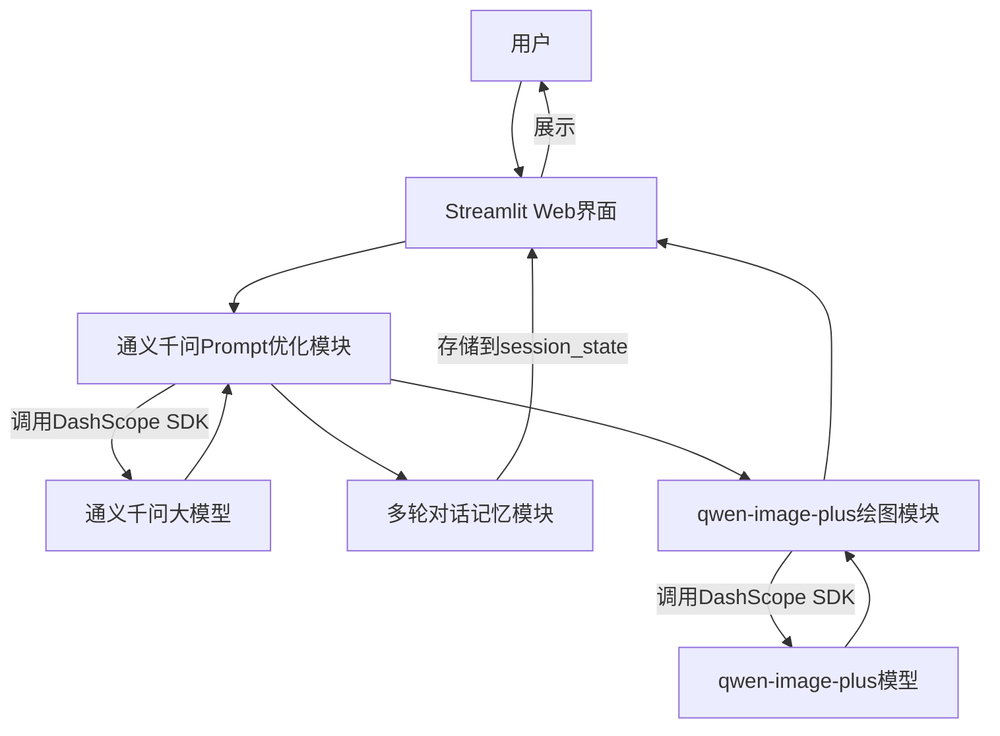

# AI绘图助手（通义千问大模型优化prompt + 通义千问专业版绘图模型qwen-image-plus）
基于阿里云通义千问大模型 + qwen-image-plus 绘图模型的多轮交互 AI 绘图工具，通过 Streamlit 搭建可视化 Web 界面，支持 Prompt 智能优化、历史对话记忆、全流程可视化展示。


## 📌 项目简介
本项目是一个**基于 Streamlit 可视化 Web 界面的本地化 AI 绘图助手**，通过通义千问大模型优化用户输入的绘图需求，再调用阿里云qwen-image-plus模型生成高质量图片，同时支持多轮对话记忆（修改指令可基于历史Prompt调整），并在web界面和终端展示完整流程日志。


## 🚀 系统框架图

- **Streamlit Web界面**：用户交互入口，展示流程日志、历史对话、生成结果；
- **通义千问Prompt优化模块**：将用户模糊需求转化为适配绘图模型的高质量提示词；
- **多轮对话记忆模块**：基于LangChain+Streamlit session_state实现历史对话持久化；
- **qwen-image-plus绘图模块**：调用阿里云绘图模型生成图片；
- **DashScope SDK**：阿里云大模型统一调用接口。


## ✨ 核心功能
1. **Prompt智能优化**：通义千问自动将用户需求补充为“主体+场景+细节+光影”的高质量提示词；
2. **多轮对话记忆**：修改指令可基于历史Prompt调整（例：先输“赛博朋克猫”，再输“加墨镜”会保留主体）；
3. **全流程可视化**：界面实时展示“解析需求→加载历史→优化Prompt→生成图片”的每一步；
4. **终端日志证明**：终端打印详细日志（用户输入、历史对话、优化结果、图片URL）；
5. **图片下载**：生成结果支持一键下载到本地。


## 📋 环境依赖
- Python 3.9+
- 依赖包：见`requirements.txt`


## 🔧 部署步骤
### 步骤1：获取阿里云API密钥
1. 登录[阿里云DashScope平台](https://dashscope.console.aliyun.com/)；
2. 进入“API密钥”页面，创建并复制**北京地域的API Key**（与代码中地域配置一致）。


### 步骤2：配置环境变量
在项目根目录创建`.env`文件，填入API密钥：
```env
DASHSCOPE_API_KEY=你的阿里云DashScope API Key
```


### 步骤3：安装依赖
```bash
pip install -r requirements.txt -i https://pypi.tuna.tsinghua.edu.cn/simple
```

### 步骤4：启动应用
```bash
streamlit run app.py
```
启动后，在浏览器中访问终端输出的`Local URL`（通常为`http://localhost:8501`）。


## 🎯 使用示例
1. **首次输入**：`画一只赛博朋克风格的猫`
   - 系统自动优化Prompt为：“一只赛博朋克风格的猫，身处未来都市的霓虹街道，身上覆盖金属质感的银蓝色鳞片，眼睛闪烁红色电子光芒...”；
   - 生成对应风格的图片。

2. **多轮修改**：`给这个猫带个墨镜显得更酷一点`
   - 系统加载历史对话，优化后的Prompt保留“赛博朋克猫”主体，新增“黑色墨镜”元素；
   - 生成带墨镜的赛博朋克猫图片。


## 📝 注意事项
1. **地域匹配**：代码中配置的是北京地域URL，需使用北京地域的API Key；若使用新加坡地域，需修改代码中`base_http_api_url`为`https://dashscope-intl.aliyuncs.com/api/v1`，并使用对应地域的API Key；
2. **额度限制**：阿里云DashScope有免费额度，不足时需在平台充值；
3. **存储空间**：避免磁盘满导致生成失败，可注释代码中“保存图片到本地”的逻辑。

